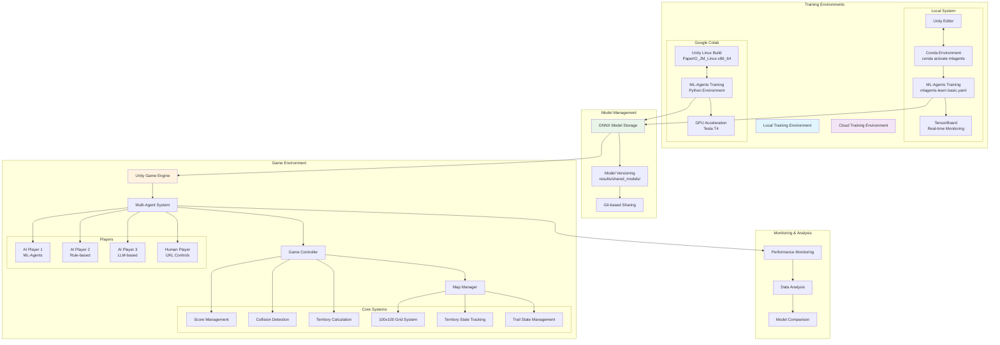

# 소프트웨어공모전 지원서

<작품 대표사진>


**출품 분야**: <u>게임SW</u>

## 1. 작품명
**Get the Territory - 강화학습 기반 멀티플레이어 영토 확장 게임**

## 2. 팀 구성
팀장 - 소프트웨어학부 20213048 서주원
팀원 - 소프트웨어학부 20213046 이태건

## 3. 기획의도

### 주제 선정 배경
거의 모든 개발 분야에서 AI의 활용 능력이 필수적으로 요구되는 현 상황에서 게임 개발 역시 인공지능 기술 도입의 필요성이 커지고 있습니다. 특히 강화학습을 비롯한 최신 머신러닝 기법이 게임 산업 전반에 적용되며 자율적이고 적응력 있는 에이전트를 요구하는 목소리가 커지고 있습니다.

이에 본 프로젝트는 Unity ML-Agents와 PPO(Proximal Policy Optimization) 알고리즘을 활용하여 '땅따먹기'라는 직관적인 게임을 개발하게 되었습니다. AI 플레이어는 실제 플레이어와 동일한 룰 안에서 실시간으로 경쟁하며, 강화학습을 통한 AI 기술의 효능을 체험하고 보여줄 수 있음에 의의를 두었습니다.

특히, 학습 가능한 에이전트를 직접 설계·훈련하고 게임 로직에 통합함으로써, AI 로직을 스스로 커스터마이징 해보며 개발 경험을 보다 넓힐 수 있는 교육적 플랫폼을 제공하고자 합니다. 또한 Google Colab과 Unity ML-Agents를 활용하여 클라우드 기반 AI 학습 환경을 구축함으로써, 고성능 컴퓨팅 자원이 없어도 누구나 AI 개발을 경험할 수 있는 접근성을 제공합니다.

## 4. 작품 설명

### 가. 작품 개요

#### 개발 목표
1. **강화학습 기반의 적 AI 구현**
   Unity ML-Agents와 PPO(Proximal Policy Optimization) 알고리즘을 활용하여, 플레이어와 AI 에이전트가 동일한 규칙하에서 '땅따먹기' 경쟁을 벌일 수 있는 실시간 대전 환경을 구축

2. **게임 개발과 머신러닝 통합 역량 강화**
   학습 파이프라인(Observation → Action → Reward)을 Unity 씬에 직접 연결해, 학습과 플레이 사이 사이클을 완성함으로써 실전 AI 모델 개발 경험 축적

3. **멀티 에이전트 상호작용 구조 실험**
   최대 4개의 AI 에이전트가 동시에 경쟁하는 멀티플레이어 시나리오를 적용하여, 다수의 학습모델이 존재하게 만들어 경쟁·영역 확보 전략을 학습시키고 안정적인 대전 시스템 설계

4. **클라우드 기반 학습 환경 구축**
   Google Colab을 통한 원격 AI 모델 훈련 시스템으로 접근성 향상

#### 개발 개요
Paper.io는 플레이어가 맵에서 이동하며 영토를 확장하는 간단하면서도 전략적인 게임입니다. 본 프로젝트는 이 게임을 Unity로 구현하고, ML-Agents 프레임워크를 통해 AI 에이전트가 자율적으로 학습하여 최적의 전략을 찾아가는 시스템을 개발했습니다.

**주요 기술 스택:**
- Unity 2022.3 (C#)
- Unity ML-Agents Toolkit (Python API)
- Proximal Policy Optimization (PPO) 알고리즘
- 로컬 Conda 환경 (주 학습 환경)
- Google Colab (보조 클라우드 학습 환경)

**이중 학습 환경 구축:**
1. **로컬 학습 환경 (Primary)**: 
   - `conda activate mlagents` → `mlagents-learn basic.yaml --run-id=run_name`
   - Unity Editor와 직접 연동하여 실시간 학습 진행
   - TensorBoard를 통한 실시간 Mean Reward 모니터링
   - 즉시 피드백과 빠른 실험 사이클

2. **클라우드 학습 환경 (Secondary)**:
   - Google Colab의 GPU 자원 활용
   - Linux 헤드리스 빌드 (PaperIO_JM_Linux.x86_64) 실행
   - 장시간 학습이 필요한 경우 활용

**핵심 학습 메커니즘:**
- **Observation**: 주변 타일 상태(빈 공간·내 땅·상대 땅·벽), 자기 위치, 상대 위치
- **Action**: 상·하·좌·우 이동 (4가지 방향)
- **Reward**: 영역 확보, 상대 꼬리 차단, 불필요 이동 억제 등 세분화된 보상 설계

AI 에이전트는 현재 맵 상태, 적의 위치, 자신의 영토 정보 등을 관찰하여 다음 행동을 결정하며, 영토 확장, 생존, 적 방해 등의 복합적인 목표를 달성하기 위해 학습합니다.

### 나. 시스템 구성도



### 다. 구현기능

#### 1. 게임 핵심 시스템

**맵 관리 시스템 (MapManager.cs)**
- 100x100 격자 기반 맵 시스템으로 고해상도 게임플레이 제공
- 실시간 영토 상태 추적 (tileStates 배열)
- 플레이어별 궤적 관리 (trailStates 배열)
- 플레이어별 초기 영토 할당 (10x10 영역)
- 싱글톤 패턴 적용으로 전역 맵 상태 관리

**게임 컨트롤러 (GameController.cs)**
- 멀티플레이어 점수 관리 및 실시간 순위 시스템
- 카메라 추적 시스템 (플레이어 따라가기/전체 맵 보기)
- 사운드 시스템 (BGM, 효과음)
- 실시간 UI 업데이트 (점수, 순위, 플레이어 상태)
- 게임 종료 조건 관리 및 승부 판정

**플레이어 컨트롤러 시스템**
- 기본 플레이어 클래스 (BasePlayerController.cs): 공통 로직 추상화
- AI 플레이어 (AIPlayerController.cs): ML-Agents 통합
- 수동 플레이어 (PlayerController.cs): 키보드 입력 처리
- 궤적 그리기 및 충돌 감지 (LineTrailWithCollision.cs)
- 코너 포인트 추적 및 영역 계산 (CornerPointTracker.cs)

#### 2. AI 에이전트 시스템

**강화학습 에이전트 (MyAgent.cs)**
- Unity ML-Agents 기반 PPO 알고리즘 사용
- 관찰 공간: 1,319차원 벡터
  - 3x3 중심 영역 관찰 (9차원): 즉시 주변 환경 인식
  - 전체 맵 상태 압축 (100x100 → 압축된 형태): 글로벌 상황 파악
  - 플레이어 위치 및 방향 정보: 자기 위치 및 적 위치 추적
  - 영토 및 궤적 상태 정보: 소유 영역과 위험 지역 구분
- 행동 공간: 4가지 이동 방향 (상, 하, 좌, 우)
- 정교한 보상 함수 시스템:
  - 영토 확장: +10점 (주요 목표)
  - 생존: +0.1점/스텝 (장기 생존 유도)
  - 사망: -10점 (리스크 회피 학습)
  - 적 제거: +5점 (공격적 플레이 유도)
  - 패턴 반복 방지: -0.5점 (다양한 전략 학습)

**학습 최적화 기법**
- 히스토리 추적 시스템: 최근 4회 이동 기록으로 무한 루프 방지
- 진행 상황 추적: 500스텝 동안 진전 없을 시 에피소드 종료
- 180도 회전 금지: 즉시 사망 방지를 위한 안전장치
- 동적 보상 조정: 게임 상황에 따른 보상 가중치 변경

**다양한 AI 구현체 비교**
- **GPT-4 기반 AI** (AIPlayerController_ClaudeSonnet4.cs): 언어모델 기반 전략 AI
- **Gemini Pro 기반 AI** (AIPlayerController_GeminiPro25.cs): 구글 AI 모델 활용
- **규칙 기반 AI** (AIPlayerController_Hardcoding.cs): 전통적인 휴리스틱 방식
- **패턴 기반 AI** (AIPlayerController_Rectangle.cs): 기하학적 패턴 추종
- **강화학습 AI** (MyAgent.cs): 본 프로젝트의 핵심 AI

#### 3. 학습 환경 시스템

**로컬 학습 환경 (Primary Training Environment)**
- **Conda 환경 기반**: `conda activate mlagents` 명령으로 학습 환경 활성화
- **Unity Editor 연동**: 실시간으로 Unity 씬과 연결되어 학습 진행
- **ML-Agents 명령어**: `mlagents-learn basic.yaml --run-id=run_name` 실행
- **실시간 모니터링**: TensorBoard를 통한 Mean Reward, Episode Length 등 실시간 지표 확인
- **즉시 피드백**: 학습 중 Unity Play 버튼으로 즉시 AI 성능 확인 가능
- **빠른 실험 사이클**: 하이퍼파라미터 조정 후 바로 재학습 가능

**Google Colab 보조 학습 환경 (Secondary Training Environment)**
- Unity Linux 빌드 실행 환경 (PaperIO_JM_Linux.x86_64)
- 헤드리스 모드 실행으로 GPU 리소스 최적화
- 장시간 학습이 필요한 경우 활용
- 로컬 자원 부족 시 클라우드 GPU 활용
- 실시간 학습 진행 상황 모니터링
- 학습된 모델 자동 저장 및 다운로드

**학습 환경 구성 및 워크플로우**
1. **로컬에서 빠른 프로토타이핑**:
   ```bash
   conda activate mlagents
   mlagents-learn basic.yaml --run-id=prototype_test
   # Unity Play 버튼 클릭 → 즉시 학습 시작
   ```

2. **TensorBoard 모니터링**:
   ```bash
   tensorboard --logdir results
   # 브라우저에서 실시간 Mean Reward 그래프 확인
   ```

3. **모델 성능 검증**:
   - 학습된 모델을 Unity Editor에서 즉시 테스트
   - 실시간으로 AI 행동 패턴 분석
   - 보상 함수 효과 즉시 확인

4. **클라우드 장시간 학습**:
   - 로컬에서 검증된 설정을 Colab으로 이전
   - GPU 자원을 활용한 intensive training
   - 학습 완료 후 로컬로 모델 다운로드

**학습 최적화 및 커리큘럼**
- 학습 에피소드 당 일정 횟수의 대전을 자동으로 수행
- 커리큘럼 러닝을 통해 난이도 단계적 상승
- 멀티 에이전트 경쟁 시나리오를 통해 집단 내·외부 상호작용 패턴 학습
- Unity Profiler로 런타임 퍼포먼스 지표 시각화 및 최적화

**모델 관리 시스템**
- ONNX 형식 모델 지원으로 크로스 플랫폼 호환성
- 버전별 모델 관리 (results/shared_models/)
- 모델 성능 평가 및 비교 시스템
- 실시간 모델 교체 시스템 (hot-swapping)
- Git 기반 모델 버전 관리 및 팀 공유

#### 4. 게임플레이 특징

**영토 확장 메커니즘**
- 안전 영역(소유 영토)과 위험 영역(궤적) 구분
- 루프 완성을 통한 영토 확장 알고리즘
- 실시간 영토 계산 및 시각화
- 영토 겹침 및 충돌 감지 시스템
- 영토 확장 효율성 측정 지표

**전략적 요소**
- 적 플레이어 궤적 차단을 통한 제거 메커니즘
- 리스크-리워드 트레이드오프 계산
- 맵 가장자리 활용 전략 (벽 근처 안전 이동)
- 적응적 플레이 스타일 (공격적/수비적 전환)
- 멀티플레이어 환경에서의 연합 및 견제 시스템

**충돌 감지 시스템**
- 벽 충돌 감지 및 즉시 사망 처리
- 플레이어 간 궤적 충돌 정밀 계산
- 자기 궤적 충돌 방지 메커니즘
- 실시간 충돌 예측 및 회피 시스템
- 충돌 애니메이션 및 이펙트 처리

#### 5. 시각적 시스템

**타일 렌더링 (TileRenderer.cs)**
- 플레이어별 색상 구분 시스템
- 영토와 궤적 시각적 차별화
- 실시간 맵 상태 업데이트
- 그리드 기반 최적화 렌더링
- 동적 로딩 및 컬링 시스템

**UI 시스템**
- 실시간 점수 표시 및 순위 시스템
- 플레이어별 순위 시스템 (TextMeshPro 활용)
- 카메라 추적 모드 전환 (플레이어 따라가기/전체 맵)
- 게임 상태 표시 (시간, 라운드, 게임 진행 상황)
- 반응형 UI 디자인 (다양한 해상도 지원)

**사운드 시스템**
- 배경음악 (BGM) 자동 재생 및 루프
- 효과음 시스템 (영토 확장, 충돌, 점수 획득)
- 3D 사운드 포지셔닝
- 사운드 믹서 및 볼륨 조절
- 게임 상황별 동적 사운드 변경

#### 6. 학습 분석 및 최적화 도구

**성능 모니터링**
- 에피소드별 학습 결과 추적
- 텐서보드 연동 시각화
- 모델 성능 비교 차트
- 실시간 학습 진행률 표시
- 학습 효율성 지표 측정

**디버깅 시스템**
- 에이전트 행동 로깅 시스템
- 보상 함수 분석 및 튜닝
- 학습 진행 상황 실시간 출력
- 에러 추적 및 예외 처리
- 성능 프로파일링 도구

**데이터 분석**
- 플레이어 행동 패턴 분석
- 승률 및 생존율 통계
- 영토 확장 효율성 측정
- AI 전략 비교 분석
- 게임 밸런스 조정 데이터

#### 7. 멀티플레이어 시스템

**동시 플레이 지원**
- 최대 4명의 플레이어 동시 경쟁
- 인간 플레이어와 AI 혼합 매칭
- 실시간 동기화 시스템
- 공정한 시작 조건 보장
- 플레이어 연결/연결 해제 처리

**네트워크 최적화**
- 상태 동기화 최적화
- 지연 시간 최소화
- 충돌 예측 및 보정
- 안정적인 게임 세션 관리
- 플레이어 재연결 지원

#### 8. 확장성 및 모듈화

**아키텍처 설계**
- 모듈화된 컴포넌트 설계
- 새로운 AI 알고리즘 쉽게 추가 가능
- 맵 크기, 플레이어 수 등 유연한 설정
- 플러그인 시스템 지원
- 코드 재사용성 최적화

**설정 관리**
- YAML 기반 설정 파일 (basic.yaml, quick_save_config.yaml)
- 런타임 설정 변경 지원
- 프로파일 기반 설정 관리
- 실험적 기능 토글 시스템
- 배포 환경별 설정 분리

## 5. 개발환경

### 개발 도구 및 플랫폼
- **Unity 2022.3.42f1**: 게임 엔진 및 ML-Agents 환경
- **Unity ML-Agents Release 21**: Unity 강화학습 프레임워크
- **Python 3.9.x**: ML-Agents 학습 환경
- **PyTorch 1.8+**: 딥러닝 프레임워크
- **Google Colab**: 클라우드 학습 환경
- **Visual Studio Code**: 코드 편집기
- **Git**: 버전 관리 시스템

### 핵심 라이브러리 및 패키지
```yaml
# Python 환경 (ML-Agents 학습)
ml-agents==1.0.0
torch==1.8.0
tensorboard==2.8.0
numpy==1.21.0
protobuf==3.20.3
```

```csharp
// Unity 패키지
Unity ML-Agents - 2.0.1
TextMeshPro - 3.0.6
Universal Render Pipeline - 12.1.8
Input System - 1.4.4
```

### 플랫폼 지원
- **Windows**: Unity 에디터 개발 환경
- **Linux**: Colab 헤드리스 빌드 (PaperIO_JM_Linux.x86_64)
- **웹**: WebGL 빌드 지원 예정

### 하드웨어 요구사항
- **로컬 개발**: 
  - CPU: Intel i5 이상 또는 AMD Ryzen 5 이상
  - RAM: 8GB 이상 (16GB 권장)
  - GPU: DirectX 11 지원 그래픽카드
  - 저장공간: 5GB 이상

- **클라우드 학습**: 
  - Google Colab GPU 런타임 (Tesla T4)
  - CUDA 11.0+ 지원
  - 12GB VRAM 권장

### 프로젝트 구조
```
Project-AI-Paper.io-ML-Agents/
├── Assets/
│   ├── Scripts/           # C# 게임 로직 (36개 파일)
│   │   ├── MyAgent.cs          # 강화학습 에이전트
│   │   ├── GameController.cs   # 게임 관리
│   │   ├── MapManager.cs       # 맵 시스템
│   │   └── AI Controllers/     # 다양한 AI 구현체
│   ├── Scenes/           # Unity 씬 파일
│   ├── Prefabs/          # 게임 오브젝트 프리팹
│   ├── ML-Agents/        # ML-Agents 설정 파일
│   └── Settings/         # 게임 설정
├── results/
│   └── shared_models/    # 학습된 AI 모델 (ONNX)
├── PaperIO_JM_Linux_Data/     # Linux 빌드 데이터
├── PaperIO_JM_Linux.x86_64    # Linux 실행 파일
├── ML-Agents with Colab.ipynb  # Colab 학습 노트북
├── basic.yaml            # ML-Agents 학습 설정
├── quick_save_config.yaml     # 빠른 저장 설정
└── README.md            # 프로젝트 가이드
```

### 배포 방식
1. **로컬 플레이**: Unity 에디터에서 직접 실행 및 테스트
2. **클라우드 학습**: Google Colab에서 헤드리스 Linux 빌드 실행
3. **AI 모델 공유**: GitHub을 통한 ONNX 모델 버전 관리
4. **웹 배포**: WebGL 빌드 후 웹 호스팅 예정

### 개발 워크플로우
1. **로컬 개발 및 빠른 프로토타이핑**: Unity 에디터에서 게임 로직 개발 및 테스트
2. **로컬 ML-Agents 학습**: 
   ```bash
   conda activate mlagents
   mlagents-learn basic.yaml --run-id=experiment_name
   ```
3. **실시간 모니터링**: TensorBoard로 Mean Reward 및 학습 진행 상황 실시간 확인
4. **즉시 성능 검증**: Unity Play 버튼으로 학습 중인 AI 성능 즉시 테스트
5. **하이퍼파라미터 튜닝**: 로컬에서 빠른 실험 사이클로 최적 설정 탐색
6. **클라우드 장시간 학습**: 검증된 설정으로 Colab에서 intensive training (선택사항)
7. **모델 통합**: 학습된 ONNX 모델을 Unity 에디터에서 최종 성능 검증
8. **버전 관리**: Git을 통한 코드 및 모델 버전 관리 및 팀 공유

### 품질 관리
- **코드 리뷰**: Pull Request 기반 코드 검토
- **자동 테스트**: Unity Test Framework 활용
- **성능 모니터링**: Unity Profiler 및 TensorBoard 활용
- **문서화**: README.md 및 ML_AGENTS_GUIDE.md 유지보수

---

## 기술적 혁신성 및 차별화 요소

### 1. 멀티모달 AI 비교 시스템
본 프로젝트의 가장 큰 차별화 요소는 다양한 AI 접근 방식을 하나의 플랫폼에서 직접 비교할 수 있다는 점입니다.

- **강화학습 AI**: PPO 알고리즘 기반 자율 학습 에이전트
- **LLM 기반 AI**: GPT-4, Gemini Pro 등 대규모 언어모델 활용
- **규칙 기반 AI**: 전통적인 휴리스틱 기법
- **패턴 기반 AI**: 기하학적 패턴 인식 기법

각 AI의 전략적 특성을 실시간으로 분석하고 시각화하여, 서로 다른 AI 기법의 장단점을 명확히 비교할 수 있습니다.

### 2. 로컬-클라우드 하이브리드 학습 시스템
기존의 ML-Agents 프로젝트들이 단일 환경에서만 실행되는 것과 달리, 본 프로젝트는 로컬과 클라우드를 유기적으로 결합한 이중 학습 환경을 구축했습니다.

**로컬 우선 학습 환경**:
- **즉시 실행**: `conda activate mlagents` → `mlagents-learn` 명령으로 즉시 학습 시작
- **실시간 피드백**: Unity Editor와 직접 연동하여 학습 과정 실시간 관찰
- **빠른 실험 사이클**: 하이퍼파라미터 조정 후 바로 재학습 가능
- **TensorBoard 모니터링**: Mean Reward, Episode Length 등 실시간 지표 확인

**클라우드 보조 학습 환경**:
- **GPU 가속**: Google Colab의 고성능 GPU 활용
- **장시간 학습**: 로컬 자원 제약 없이 intensive training 가능
- **헤드리스 실행**: Linux 빌드로 효율적인 학습 환경 구성

**하이브리드 워크플로우**:
- **로컬에서 빠른 프로토타이핑** → **클라우드에서 본격 학습** → **로컬에서 최종 검증**
- **실시간 모델 교체**: 학습 중인 모델을 즉시 게임에 적용
- **A/B 테스트**: 서로 다른 모델 버전 간 성능 비교

이러한 이중 환경 구조는 AI 개발의 진입 장벽을 크게 낮추며, 개발자가 상황에 따라 최적의 학습 환경을 선택할 수 있도록 합니다.

### 3. 교육용 강화학습 플랫폼
복잡한 설정 과정 없이 바로 시작할 수 있는 즉시 실행 환경을 제공합니다.

- **원클릭 실행**: Unity Play 버튼만으로 AI 대전 시작
- **단계별 튜토리얼**: ML_AGENTS_GUIDE.md를 통한 상세한 가이드
- **실시간 시각화**: TensorBoard 연동으로 학습 과정 시각화
- **모듈화된 구조**: 새로운 AI 알고리즘 쉽게 추가 가능

### 4. 확장 가능한 아키텍처
미래 확장성을 고려한 모듈화된 설계로, 다양한 연구 목적으로 활용할 수 있습니다.

- **플러그인 시스템**: 새로운 AI 알고리즘 쉽게 추가
- **유연한 게임 설정**: 맵 크기, 플레이어 수 등 동적 조정
- **다양한 게임 모드**: 개인전, 팀전, 토너먼트 등 확장 가능
- **크로스 플랫폼**: Windows, Linux, 웹 등 다양한 플랫폼 지원

### 5. 실시간 멀티 에이전트 상호작용
최대 4개의 AI 에이전트가 동시에 경쟁하는 복잡한 멀티 에이전트 환경을 구현했습니다.

- **동적 전략 변화**: 상황에 따른 공격적/수비적 전략 전환
- **연합과 견제**: 다른 에이전트와의 협력 및 경쟁 관계 학습
- **실시간 적응**: 상대방 전략 변화에 따른 즉시 대응
- **집단 지능**: 개별 에이전트의 행동이 전체 시스템에 미치는 영향 분석

## 프로젝트 의의 및 기대효과

### 교육적 가치
- **AI 교육 도구**: 강화학습 개념을 직관적으로 이해할 수 있는 시각적 도구
- **실습 환경**: 이론과 실제를 연결하는 hands-on 학습 경험
- **연구 플랫폼**: 다양한 AI 알고리즘 실험 및 비교 분석 가능

### 기술적 기여
- **오픈소스 프로젝트**: GitHub을 통한 코드 공개 및 커뮤니티 기여
- **모델 공유**: 학습된 AI 모델을 커뮤니티와 공유
- **벤치마크**: 다양한 AI 기법의 성능 비교 기준 제시

### 산업적 활용
- **게임 AI 개발**: 상용 게임에서의 AI 에이전트 개발 참고
- **시뮬레이션 도구**: 복잡한 환경에서의 에이전트 행동 예측
- **교육 컨텐츠**: 대학교 AI 수업 및 온라인 강의 활용

이 프로젝트는 게임과 AI 기술을 결합하여 교육적 가치와 재미를 동시에 제공하는 혁신적인 플랫폼입니다. 누구나 쉽게 접근할 수 있으면서도 깊이 있는 AI 학습을 경험할 수 있도록 설계되었으며, 강화학습 기술의 대중화에 기여할 것으로 기대됩니다.

---

**※ 본 프로젝트는 총 10페이지 내외로 작성되었으며, 1차 서류 심사를 통해 2차 데모 심사 대상 선발을 목표로 합니다.**
